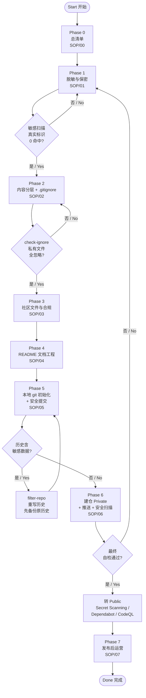

# GitHub 公开发布经验库与 SOP（中英双语）
# GitHub Public Release Playbook & SOP (English / 中文)

> This repository is a **living playbook** distilled from two real open-source releases: the **Jiaolong 15K** laptop optimization project and the **Acer A615-51G** optimization project. It captures the **hard-won lessons, checklists, compliance templates, and step-by-step SOPs** for safely turning a personal reverse-engineering / power-tuning project into a public GitHub repository. Every item here was **learned the hard way and verified on a real machine**. See each file for details.

> 本仓库是一份**可持续升级的可执行经验库**，沉淀自两个真实开源发布项目：**蛟龙15K** 笔记本优化项目 与 **Acer A615-51G** 优化项目。它记录了把个人逆向/电源调优项目**安全地发布为公开 GitHub 仓库**的所有**踩坑教训、检查清单、合规模板与分步 SOP**。每一条都是**真机实测、花钱买来的经验**，见各文件详述。

> **How to use:** Read the full checklist at `SOP/00_总清单_发布自检.md` first. Then follow the phase-by-phase SOPs `SOP/01_...`→`SOP/06_...`. Templates live in `templates/`. Lessons are cross-referenced from each phase. When you learn something new or meet a new gremlin, **append it to the relevant SOP and update `00_总清单`** — this playbook is meant to grow, not to be static.

> **如何使用：** 先通读 `SOP/00_总清单_发布自检.md` 完整清单；再按 `SOP/01_...`→`SOP/06_...` 的分阶段 SOP 执行；模板在 `templates/`；每阶段的「坑」互相引用。当你踩到新坑或学到新方法，**把它追加到对应 SOP 并更新 `00_总清单`**——这份手册是为"生长"而设计的，不是静态文档。

---

## 📁 Repository Layout / 目录结构

```
github-publish-playbook/
├── README.md                  This overview (English + 中文)  本导航
├── SOP/                       Phase-by-phase Step-by-step SOPs  分阶段 SOP
│   ├── 00_总清单_发布自检.md     Release self-check master checklist  发布总自检清单
│   ├── 01_脱敏与保密.md          Redaction & secrecy  脱敏与保密
│   ├── 02_内容分层与gitignore.md  Content layering & .gitignore  内容分层与忽略规则
│   ├── 03_社区文件与合规文档.md    Community files & compliance docs  社区文件与合规文档
│   ├── 04_README与文档工程.md    README & documentation craft  README 与文档工程
│   ├── 05_本地git初始化与安全提交.md Local git init & safe first commit  本地 git 初始化与安全提交
│   ├── 06_建仓推送与安全扫描.md    Repo creation, push & security scanning  建仓、推送与安全扫描
│   ├── 07_发布后运营与GitHub配置.md Post-release ops & GitHub config  发布后运营与配置
│   └── 08_发布流程图与门禁.md     Release flow diagram & stage gates  发布流程图与门禁
├── templates/                 Reusable compliance file templates  可复用合规模板
│   ├── LICENSE.mt             MIT template (author-signature aligned)  MIT 模板（署名）
│   ├── THIRDPARTY.mt          Third-party license declaration template  第三方许可声明模板
│   ├── SECURITY.mt            Security policy template  安全政策模板
│   ├── CONTRIBUTING.mt        Contribution guide template  贡献指南模板
│   ├── CHANGELOG.mt           Keep-a-Changelog template  变更记录模板
│   ├── FUNDING.mt             Funding/sponsor placeholder template  Sponsor 占位模板
│   └── .gitignore.mt          Sanitized .gitignore template  脱敏忽略规则模板
├── lessons/                   Cross-cutting lessons & anti-patterns  通用教训与反模式
│   └── 经验教训与反模式.md       Consolidated gremlin log & anti-patterns  踩坑大全与反模式
└── assets/
    ├── donate_wechat.jpg      Donation QR (WeChat) 微信收款码
    └── donate_alipay.jpg      Donation QR (Alipay) 支付宝收款码
```

---

## 🔑 Core Principles / 核心原则

| Principle 原则 | What it means 含义 | Where 出处 |
|------|------|------|
| **结论与方法论公开，破解工序绝不公开** / Publish conclusions & methods, never cracking forensics | Public repo ships only conclusions, register maps, spec, methodology, self-written code. Cracking procedures (captures, dumps, credential scripts, OEM registry snapshots) live in a private, `.gitignore`-excluded directory. | `SOP/02` |
| **脱敏优先，占位符替代** / Redact first, use placeholders | Real usernames, hostnames, UUIDs, passwords, MACs → `<USER>` `<HOSTNAME>` `<WIN_C_UUID>` `<REDACTED_PWD_SALT>` etc. Never commit real identities. | `SOP/01` + `lessons` |
| **零明文凭据，纯数密码也要扫** / Zero plaintext creds, scan pure-numeric too | Even purely-numeric passwords may escape GitHub Secret Scanning; redact them manually. | `SOP/01` + `lessons` |
| **先私有推，再转公开** / Push private first, go public later | Create repo Private, verify, then flip Public only after a final self-check. | `SOP/06` |
| **第三方二进制不随仓分发** / No third-party binaries in the repo | Do not ship `ryzenadj.exe`/`WinRing0d*.dll`/`inpoutx64.dll`; declare them in `THIRDPARTY.md` and let users fetch from upstream. | `SOP/03` + `templates/THIRDPARTY.mt` |
| **苛刻经验逐条留痕，供后人借鉴** / Document the gremlins, don't delete retracted claims | Keep retracted conclusions annotated rather than deleting them; keeps a correction ledger. | `lessons` |
| **文档随项目同步生长** / Docs grow with the project | Add English overview, bilingual README, capability-table, known-issues task-list; re-run scans on every change. | `SOP/04` |

---

## 🚀 Quick Start (new release) / 新建发布速通

1. **脱敏** all personal data & credentials → placeholders (`SOP/01`).
2. **分层**: conclusions/methods/code into public tree; forensics & private → `_private_不上传/` (excluded) (`SOP/02`).
3. **合规文件**: `LICENSE` + `THIRDPARTY.md` + `SECURITY.md` + `CONTRIBUTING.md` + `CHANGELOG.md` + `FUNDING.yml` (`SOP/03`, templates ready) (`SOP/03` templates)。
4. **README**: bilingual, disclaimer, capability table, known-issues (`SOP/04`).
5. **git init** on `main`, neutral→real signature, safe add (never `-A`), `git check-ignore` per-file (PS5.1 BOM gotcha) (`SOP/05`).
6. **Scan**: `git grep`/gitleaks; if you must rewrite history use `git filter-repo` (never `filter-branch`) with a pre-rewrite bundle backup (`SOP/05` + `lessons`).
7. **Push**: gh CLI / API — create repo **Private**, push, enable Secret Scanning + push protection + Dependabot + CodeQL; verify push with `ls-remote` (PS misreads stderr) (`SOP/06`).
8. **Flip Public** only after final self-check; keep SEPARATE repos per project (don't jumble multiple projects). (`SOP/06`).

---

## 🗺️ Release Flow Diagram / 发布流程图

> A Mermaid flowchart rendering the 0→7 publish pipeline, including the **two decision loops** (redaction and check-ignore) and the final gate before **Public**. See `SOP/08` for the full-size diagram + per-stage input→output→gate table.
> Mermaid 绘制 0→7 发布管线，含**两个校验回环**（脱敏、check-ignore）与转 **Public** 前的最终闸门。完整尺寸图 + 逐阶段「输入→产出→验证门」表见 `SOP/08`。



> **Reading the loops:** a loop pointing back to a phase means **the phase is not complete until the check passes** — that is the core of this playbook's safety model. 回环含义：**校验通过才算该阶段完成**——这正是本经验库安全模型的核心。

---

## 🗂️ The Backbone SOPs / 骨干 SOP 一览

- [**SOP/00_总清单_发布自检**](SOP/00_总清单_发布自检.md) — One-page master release checklist (English + 中文). 一页发布总清单。
- [**SOP/01_脱敏与保密**](SOP/01_脱敏与保密.md) — Redaction inventory, placeholders, credential redaction, scanning. 脱敏清单与保密扫描。
- [**SOP/02_内容分层与gitignore**](SOP/02_内容分层与gitignore.md) — Public/private layering, `_private_不上传`, `.gitignore` rules. 内容分层与忽略规则。
- [**SOP/03_社区文件与合规文档**](SOP/03_社区文件与合规文档.md) — LICENSE/THIRDPARTY/SECURITY/CONTRIBUTING/CHANGELOG/FUNDING. 社区文件与合规文档。
- [**SOP/04_README与文档工程**](SOP/04_README与文档工程.md) — Bilingual README, disclaimer, capability table, known-issues. README 与文档工程。
- [**SOP/05_本地git初始化与安全提交**](SOP/05_本地git初始化与安全提交.md) — init, signature, safe add, check-ignore, history rewrite. 本地 git 初始化与安全提交。
- [**SOP/06_建仓推送与安全扫描**](SOP/06_建仓推送与安全扫描.md) — gh CLI create/push, Secret Scanning, CodeQL, Dependabot. 建仓、推送与安全扫描。
- [**SOP/07_发布后运营与GitHub配置**](SOP/07_发布后运营与GitHub配置.md) — Sponsor, releases, follow-up, keep separate repos. 发布后运营与配置。
- [**SOP/08_发布流程图与门禁**](SOP/08_发布流程图与门禁.md) — Mermaid release flow + per-stage input→output→gate table. 发布流程图与逐阶段门禁表。
- [**lessons/经验教训与反模式**](lessons/经验教训与反模式.md) — The consolidated gremlin log (gits-only, no secrets). 踩坑大全与反模式。

Detailed table of contents inside README of each folder. 详见各目录内索引。

---

## ⚠️ Disclaimer / 免责声明

**English:** This repository contains only **original documentation, methodology, checklists, templates authored by the owner**, and **general-purpose, widely-known factual guidance**. It does **not** contain any OEM/vendor proprietary binaries, decompiled artifacts, firmware images, credentials, or personal machine data. It is a **personal self-generated engineering knowledge base**, not affiliated with, endorsed by, or a product of GitHub, any OS vendor, or any laptop manufacturer. Security guidance here reflects general public best practice (redaction, `.gitignore`, gitleaks, GitHub Secret Scanning / CodeQL / Dependabot) and should be **reviewed and adapted to your own situation**; **use at your own risk**.

**中文：** 本仓库仅包含**原创文档、方法论、检查清单与模板**，以及**通用、广为人知的事实性指引**。**不包含**任何 OEM/厂商专有二进制、反编译产物、固件镜像、凭据或个人机器数据。这是**个人自研的工程经验库**，与 GitHub、任何操作系统厂商或笔记本厂商**无官方关联**。文中安全指引反映通用公开最佳实践（脱敏、`.gitignore`、gitleaks、GitHub Secret Scanning / CodeQL / Dependabot），请**结合自身情况审阅调整**；**风险自负**。

---

## 📄 License / 许可

This project is licensed under the **MIT License** (see [LICENSE](LICENSE)), Copyright © **段雪健 (Duan Xuejian)**. 本项目以 **MIT License** 授权（见 [LICENSE](LICENSE)），版权归 **段雪健 (Duan Xuejian)**。

---

## 💰 Donation / Sponsorship 打赏 · 赞助

> If this playbook helps you release your own project safely, you are welcome to voluntarily support the author. Donations do not change the MIT free-license nature. / 若这套经验库帮你安全发布了项目，欢迎自愿支持作者。打赏不改变 MIT 的免费许可性质。

| 微信 (WeChat) | 支付宝 (Alipay) |
|------|------|
|  |  |