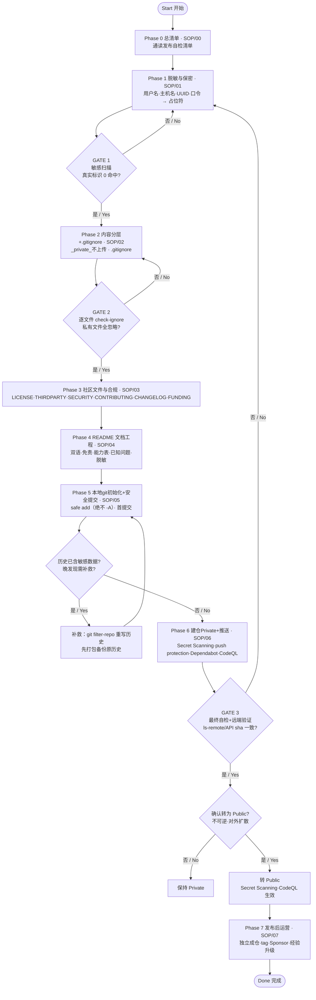

# 08_发布流程图与门禁 / 08. Release Flow Diagram & Stage Gates

> **English:** This is the **as-implemented** release pipeline as a Mermaid flowchart, plus a per-stage **Input → Deliverable → Gate** table. The gates are the heart of the safety model: **a phase is not "done" until its gate passes**; a loop back means "redo this phase". For phase-level detail, follow the per-phase SOP (00–07).

> **中文：** 这里是**按真实落地方式**绘制的 Mermaid 发布流程图，以及逐阶段 **输入 → 产出 → 验证门** 表。验证门是本安全模型的核心：**校验通过才算该阶段完成**；回环箭头表示"回到该阶段重做"。各阶段细节见对应 SOP（00–07）。

---

## 1. Full Flow Diagram / 完整流程图

---

## 2. Per-Stage Input → Deliverable → Gate / 逐阶段 输入 → 产出 → 验证门

| Phase 阶段 | Input 输入 | Deliverable 产出 | Gate 验证门（通过才进下一阶段） |
|---|---|---|---|
| **0 总清单** | 新建发布需求 | 决定用本 playbook | 通读 `00_总清单` 全部理解 |
| **1 脱敏与保密** | 全项目文件 | 占位符替换后的公开树 + README「关于脱敏」登记 | **GATE 1**：`git grep` 真实标识 0 命中；纯数字口令人工审查通过 |
| **2 内容分层+.gitignore** | 私有取证/凭据内容 | 公开树 + `_private_不上传/` + `.gitignore` | **GATE 2**：逐文件 `check-ignore` 私有目录 0 未忽略；无第三方不可再分发二进制 |
| **3 社区文件与合规** | 项目事实 | LICENSE/THIRDPARTY/SECURITY/CONTRIBUTING/CHANGELOG/FUNDING + assets | 各文件齐备、署名正确、THIRDPARTY 有日期与上游链接 |
| **4 README 文档工程** | 公开层素材 | 双语 README | 每节先英后中、免责/能力表/已知问题/未公开/脱敏/打赏齐全；文件数与 `git ls-files` 对齐 |
| **5 本地git+安全提交** | 公开树 | main 分支首提交 | `status`/`diff --cached` 人工核对无 `_private`；`check-ignore` 全通过；敏感扫描 0 命中；提交信息规范 |
| **6 建仓Private+推送** | 本地首提交 | Private 仓 main 推送 + 开启扫描 | **GATE 3**：`ls-remote`/API sha 与本地一致；Secret Scanning/Dependabot/CodeQL（公开后）就位；最终自检通过 |
| — decide Public — | 自检通过的 Private 仓 | 公开选择确认 | **确认不可逆**：转 Public 前最后审视 |
| **7 发布后运营** | Public 仓 | 独立成仓、tag/release、Sponsor/FUNDING、持续升级本经验库 | 每仓库独立；发布后遇到的每个新坑都追加回本 SOP 并更新 `00_总清单` |

---

## 3. What each icon / arrow means / 图标与箭头含义

- **方框 `[ ... ]`** — 一个阶段（phase）。Each phase maps 1:1 to a SOP file.
- **菱形 `{ ... }`** — 决策门（gate）。Checkpoints; exit condition.
- **回环箭头 (loop back)** — "未通过则该阶段未完成，回到该阶段重做"，**不是**死循环而是一次校验往返。Loop = "redo until pass".
- **圆角 `([ ... ])`** — 起始/结束（start / terminal）。
- **` `** — 节点内换行（force line break inside a node）。

> Every gate has an **automated or semi-automated** check (grep / check-ignore / ls-remote) so it's not a vibe-check. 每个门都有可执行的（grep / check-ignore / ls-remote）检查，不是凭感觉。

---

## 4. Why Mermaid / 为什么用 Mermaid

- **GitHub 原生渲染**（列表/Issue/README）零依赖；也可被 GitHub Actions/CI 或静态站 (mkdocs/mdBook) 抓取。Rendered natively on GitHub — zero JS dependencies.
- **单一事实源**：改 SOP 就同步改图，避免图文漂移。Single source of truth if you keep the diagram beside the phase docs.
- 若需要**泳道/跨设备时序**视角，可以用 Mermaid `sequenceDiagram`（某人某阶段做了什么）；现有的 `flowchart` 更贴合"阶段+决策门"的发布科学。If you later want a per-actor timeline, a `sequenceDiagram` variant can be added — the `flowchart` above fits the release-science model better.

---

## ✅ Checklist / 本阶段自检
- [ ] README 顶部含总览流程图
- [ ] 8 个 SOP 齐备，回环箭头与实际校验一致
- [ ] GATE 1 / GATE 2 / GATE 3 都可执行验证

*Generated by github-publish-playbook · 2026-08-31*